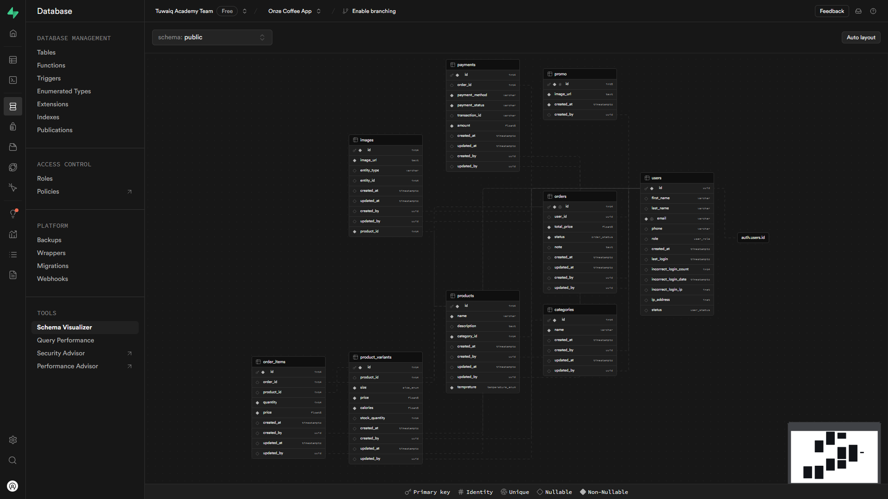
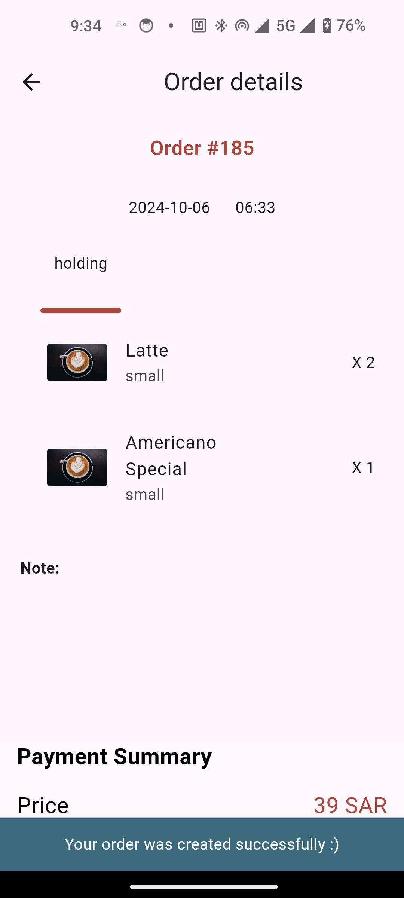
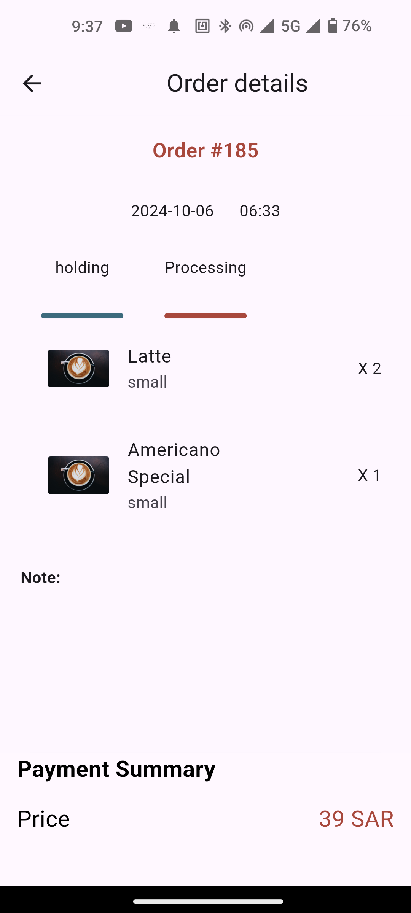
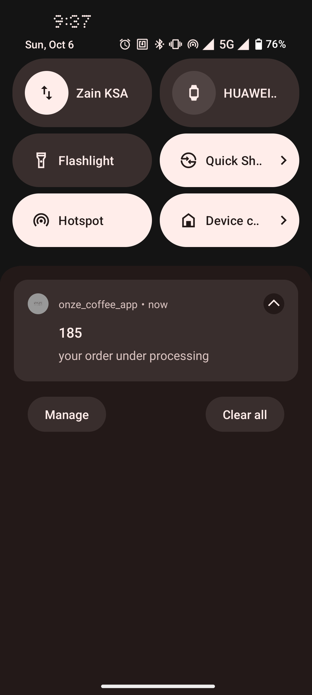
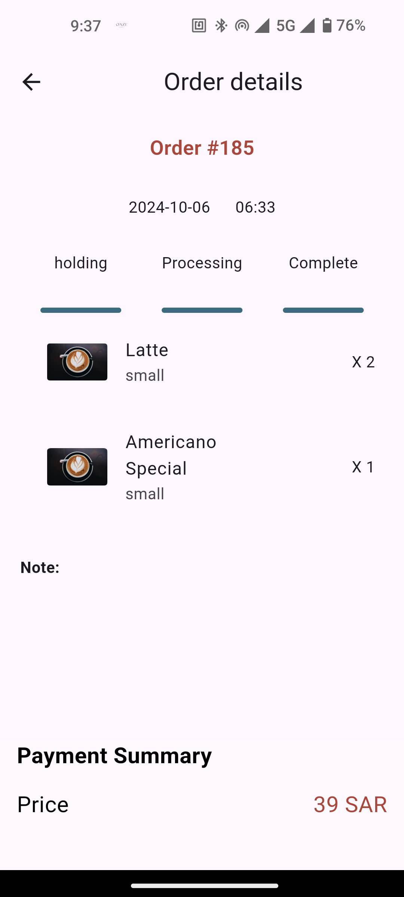
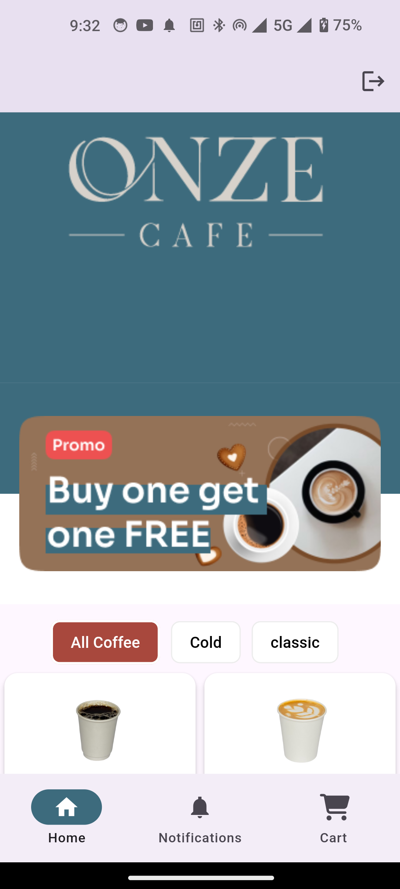
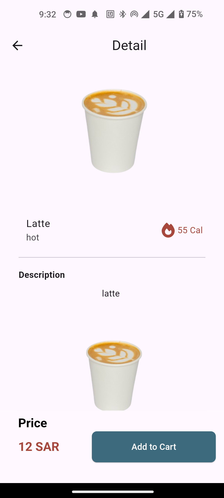
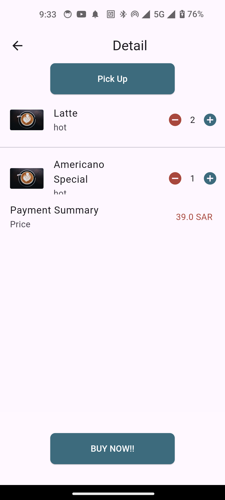
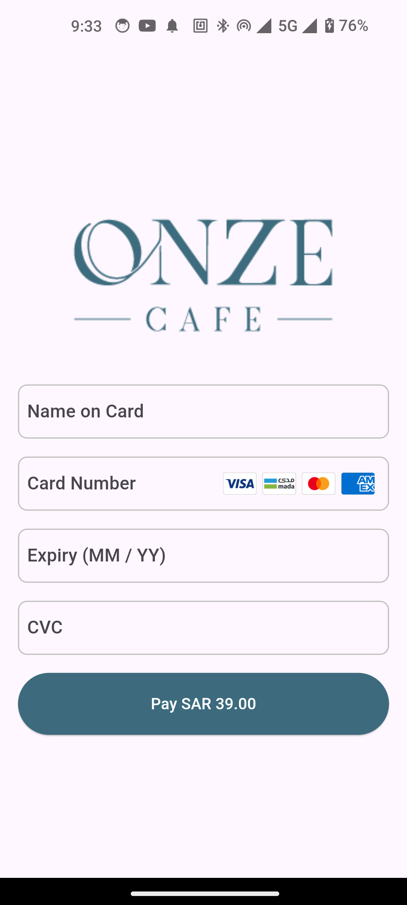

---

### Coffee Shop Management System with Online Orders and Operations Management

#### Introduction:
This system aims to develop a coffee shop management application that allows customers to place coffee orders online while providing management and tracking features for employees. Data is stored in a Supabase database, ensuring efficiency and security.

#### Key Features of the Application:

##### 1. **User Interface (Customers):**
- **Coffee Ordering:**
  - Choose coffee size from several available options.
  - Add custom notes to the order (e.g., type of milk, sugar level, etc.).
  - Make online payments directly within the app using a compatible payment gateway.
  
- **Browse Products:**
  - View all available products added by employees, such as types of coffee and desserts.
  - Browse products by categories (e.g., hot coffee, iced coffee, desserts).
  - View product details, including descriptions, prices, and images.

- **Order Tracking:**
  - View real-time order status (e.g., being prepared, in delivery, etc.).
  - Receive instant notifications when any updates occur to the order status (e.g., order acceptance or rejection).

##### 2. **Operations Management (Employees):**
- **Product Management:**
  - Add and update products (e.g., types of coffee, desserts) with the ability to upload images.
  - Organize products into different categories for easy browsing (e.g., "Hot Drinks," "Cold Drinks," "Desserts").
  - Modify details for each product (description, prices, availability).
  
- **Order Management:**
  - Display the current orders and update their statuses.
  - Accept or reject orders easily with the option to provide rejection notes.
  - Track the order status from preparation to delivery.

#### **Integration with Supabase:**
- **Database:**
  - Store customer, order, and product data in a Supabase database.
  - Retrieve and update data instantly using the Supabase SDK.
  
#### **Other Technologies:**
- **Instant Notifications:**
  - Use push notification services to instantly update customers about the status of their orders.
  
- **Payment System:**
  - Integrate the payment gateway (e.g., Stripe or PayPal) to securely and smoothly process payments within the app.

---

### Screenshot
Here is a screenshot of the current database structure used in the application:













---

### Packages

This project makes use of the following Flutter packages:

- **font_awesome_flutter: ^10.7.0** - Provides icons from the FontAwesome library.
- **moyasar: ^2.0.13** - Integrates Moyasar payment gateway for online payments.
- **readmore: ^3.0.0** - Expands text with a "read more" feature.
- **supabase_flutter: ^2.6.0** - Facilitates integration with Supabase for database management.
- **flutter_bloc: ^8.1.6 / bloc: ^8.1.4** - For state management using the Bloc pattern.
- **get_it: ^8.0.0** - A service locator for dependency injection.
- **equatable: ^2.0.5** - Helps simplify equality comparisons in Dart objects.
- **file_picker: ^8.1.2** - Allows users to select and upload files.
- **cached_network_image: ^3.4.1** - Caches network images to improve performance.
- **loading_animation_widget: ^1.2.1** - Displays loading animations.
- **flutter_image_slideshow: ^0.1.6** - Provides image slideshow functionality.
- **awesome_notifications: ^0.9.3+1** - Enables push and local notifications.
- **pinput: ^5.0.0** - Creates PIN or OTP input fields.

---

### How to Run the App

To run the Coffee Shop Management System app from GitHub, follow these steps:

1. **Clone the Repository:**
   Open your terminal and run the following command to clone the repository:
   ```bash
   git clone https://github.com/trt14/onze_coffee_app
   ```

2. **Navigate to the Project Directory:**
   Change into the project directory:
   ```bash
   git checkout the_logic_team
   ```

3. **Install Dependencies:**
   Make sure you have Flutter installed. Run the following command to get the required packages:
   ```bash
   flutter pub get
   ```

4. **Set Up Supabase:**
   Make sure to configure your Supabase credentials in the project as required. Refer to the Supabase documentation for more details.

5. **Run the App:**
   Finally, run the app using:
   ```bash
   flutter run
   ```

Make sure your device (emulator or physical device) is connected and recognized by Flutter.


